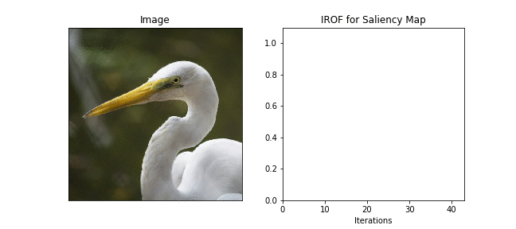

# Compute IAUC, DAUC, IROF scores to measure the quality of image attributions (PyTorch)

Use this package to evaluate the quality of your attribution wrt. to the original image. 
For that purpose, you can compute IAUC (Insert Area Under Curve, Insertion score), DAUC (Delete Area Under Curve, Deletion score) and IROF (Iterative Removal Of Features).

Install via [PyPi](https://pypi.org/project/explainable-ai-image-measures/):
``pip install explainable-ai-image-measures``

The shared idea behind all of them is to remove the most relevant pixels from the original image and replace it by a baseline color (DAUC, IROF) or to take blank a blank image and add the most relevant pixels again starting with the most relevant (IAUC). In contrast to IAUC and DAUC, IROF does this superpixel-wise. 
1. Create new images by removing / adding pixels / entire areas
2. Send the newly created images through the network and save the probabilities.
3. Compute the Area Under the Curve (AUC) for the recorded probabilities. 
4. Interpretation: For DAUC lower scores are better, for IROF and IAUC higher scores.



In contrast to other publicly available code, 
* the demanding computation is fully running on the GPU (no numpy or CPU in between)
* you can compute the scores for a single image also batch-wise
* there is parametrization possible to suit your needs
* IAUC, DAUC and IROF is possible using a single package
* multiple attributions for multiple images are possible (see [example.ipynb](example.ipynb))

Here is a minimal code example for a single image: 
```python
import torch
from captum.attr import Saliency
import torchvision.models as models

from explainable_ai_image_measures import Measures

device = torch.device("cuda" if torch.cuda.is_available() else "cpu")
model = models.resnet18(pretrained=True).to(device)

image = torch.rand((1, 3, 224, 224)).to(device)
attribution = Saliency(model).attribute(image, target=17)

# Average the attribution over the color channels
attribution = torch.mean(attribution, dim=1)

measure = Measures(model, batch_size=250, irof_segments=70)
score, y = measure.compute_IROF(image[0], attribution[0], 17)

```

